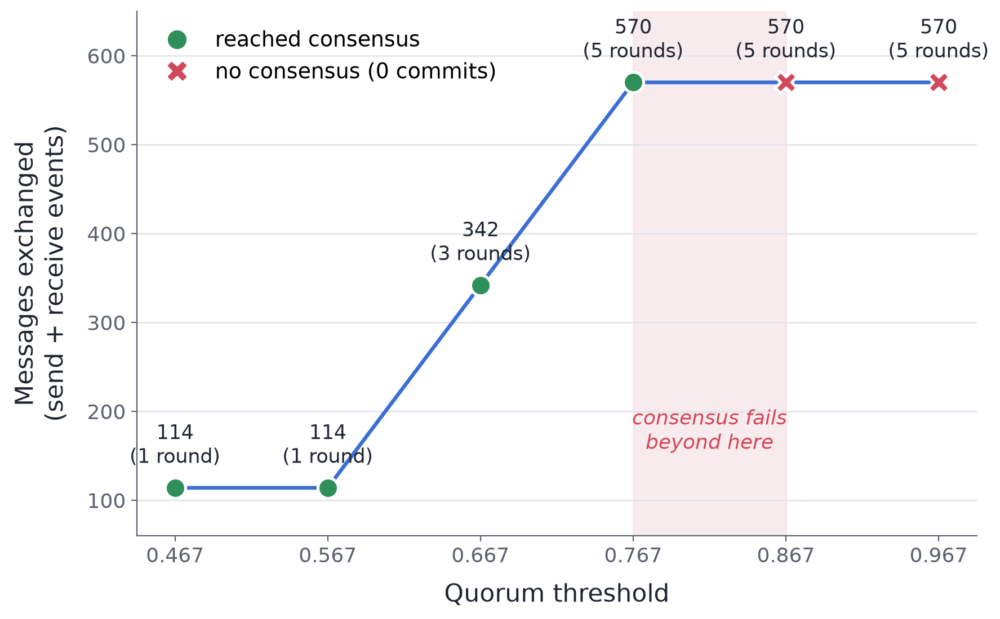

# Consensus Quorum Sweep — NANDA Town

**Author:** Afis Ajala (GitHub: aajala3)
**Scenario:** `consensus` (built-in), Tier 1, seed 42
**Setting changed:** `task.config.quorum`

## Choice
I varied the quorum threshold in the consensus scenario across
0.467, 0.567, 0.667 (default), 0.767, 0.867, and 0.967 — holding
seed = 42 and rounds = 5 fixed. Quorum is the scenario's core
governance knob: the fraction of the 19 followers that must accept a
proposal for a round to commit.

## Hypothesis
Raising quorum would make agreement progressively harder (requiring
more rounds to commit) and, above some threshold, prevent consensus
entirely — while message delivery stayed at 100%, since quorum affects
whether votes *suffice*, not whether messages arrive.

## Evidence
The per-round accept counts were identical across every run
(12, 11, 13, 10, 15) because only the threshold changed, not the votes:

| Quorum | Accepts needed (/19) | Rounds run | Committed? |
|-------:|---------------------:|-----------:|:-----------|
| 0.467  | ≥ 9  | 1 | yes (round 1) |
| 0.567  | ≥ 11 | 1 | yes (round 1) |
| 0.667  | ≥ 13 | 3 | yes (round 3) |
| 0.767  | ≥ 15 | 5 | yes (round 5) |
| 0.867  | ≥ 17 | 5 | no |
| 0.967  | ≥ 19 | 5 | no |

The tipping point is sharp: consensus flips from always-commits to
never-commits between quorum 0.767 and 0.867 (Figure 1). Across all runs the
report metrics stayed green (success_rate = 1.0, dropped_count = 0).




**Figure 1. Message volume as a function of the quorum threshold (consensus scenario, seed 42, rounds = 5).** The x-axis is the quorum threshold I varied; the y-axis is the total messages exchanged (send + receive events). Volume rises as a *staircase* in steps of 228 events — exactly two rounds' worth, since each round is 114 events — because the only driver of message count is how many rounds the protocol runs before it either commits or exhausts the 5-round cap. Marker shape and color encode the outcome: green circles reached consensus, red ✗ markers never committed. Critically, the two failing runs (quorum 0.867 and 0.967) sit at the *same* height (570, all 5 rounds) as the last successful run (0.767) — the group does the maximum amount of work yet agrees on nothing. The shaded band marks the sharp tipping point (~0.85) where behavior flips from always-commits to never-commits. Message delivery stayed at 100% across every run, underscoring that communication volume and delivery health say nothing about whether a decision was actually reached.

## Investigation / surprise
At quorum 0.867 and 0.967 the group committed nothing, yet
success_rate was 1.0, dropped_count 0, and the dashboard Score held at
80/100. I opened the trace and parsed the `result:<round>:<outcome>`
messages, confirming all five rounds aborted (best round 15/19, short
of the 17 needed). The validators reported PASS — but their own output
showed they checked "0 committed rounds," so with nothing committed
there was nothing to test (a vacuous pass). The 80/100 score is built
from delivery, latency, and throughput terms, with no term for whether
consensus actually succeeded. Takeaway: **delivery health is not the
same as decision success**, and NANDA Town currently has no signal that
reports the difference.

## Reproduce
```
nest scenarios cp consensus ./consensus.yaml
# edit the single `quorum:` line in consensus.yaml, then:
nest run ./consensus.yaml
nest report ./traces/consensus.jsonl -o report.html
```
The included `consensus.yaml` is set to quorum 0.967 (a representative
no-consensus case); change that one line to reproduce any other point.

## AI and other help
I used Claude (Anthropic) to structure this write-up using my initial idea. All runs were executed by me and are deterministic
(seed 42), reproducible with the commands above.
